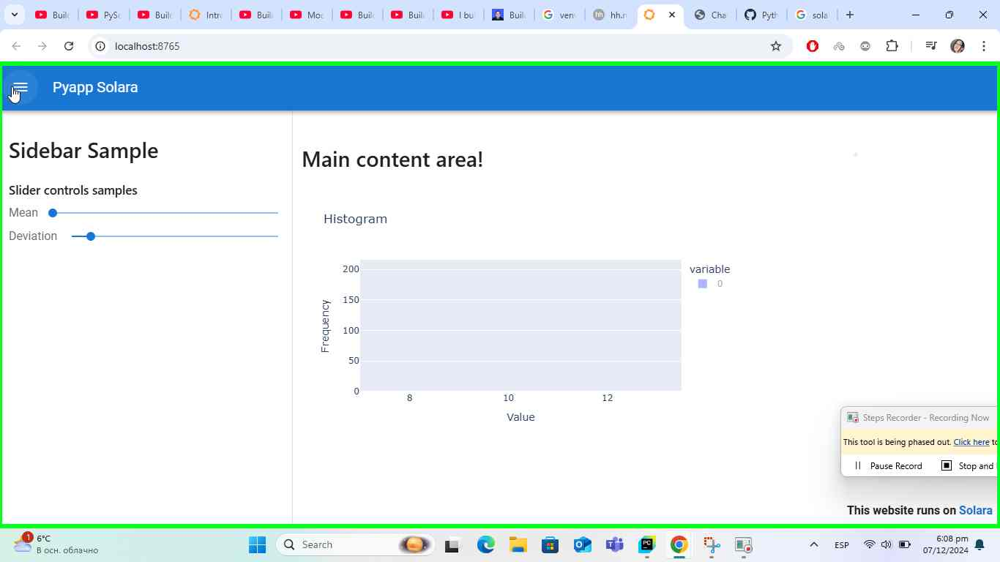

## Python Web Application with a Solara in a few minutes
Some solara apps are easier for implement measuring with a Streamlit.
Solara provides the familiar features as an alternative for build Web Application with interactive data visualization dashboard.

*Thanks a DeepCharts [Youtube](https://www.youtube.com/watch?v=hXA4JPNXhqQ) user for a code samples!*

## Preview


## Installation
Dependencies are necessary: 
```console
pip install solara 
pip install plotly 
pip install numpy
```
## Usage
Run
```console
solara run PyApp_Solara.py 
```

##ERRORS-TROUBLESHOOTING: 
  if you have unexpected error, please put into your code the next definition:
    def name():
  where the name is a Page(constantly)
